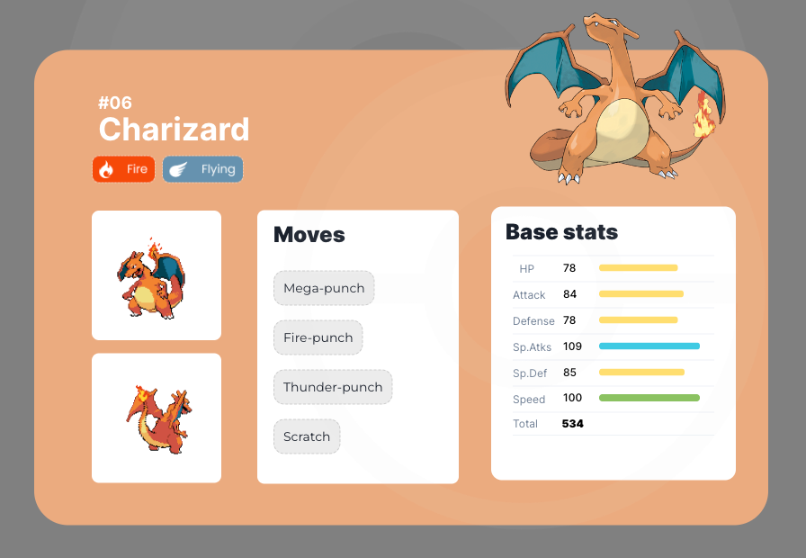
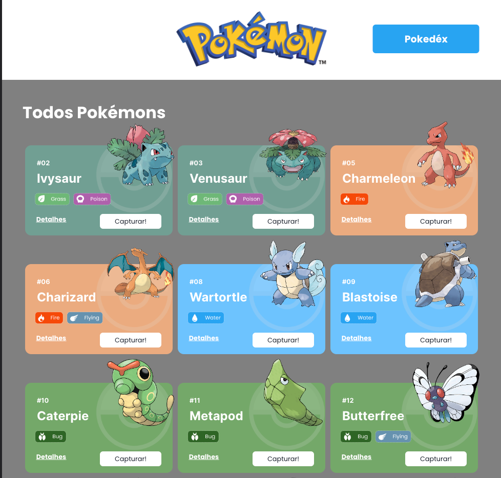
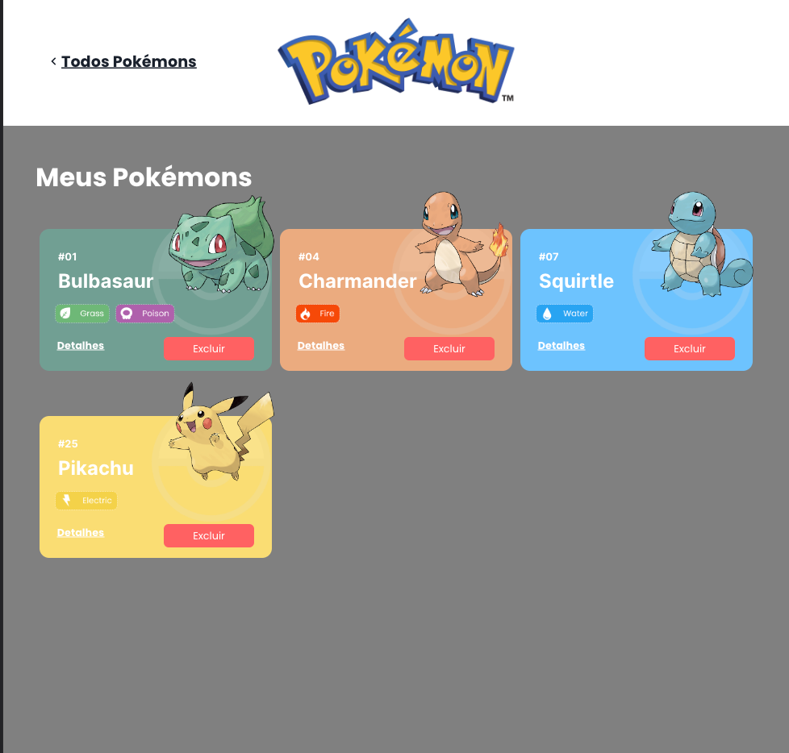
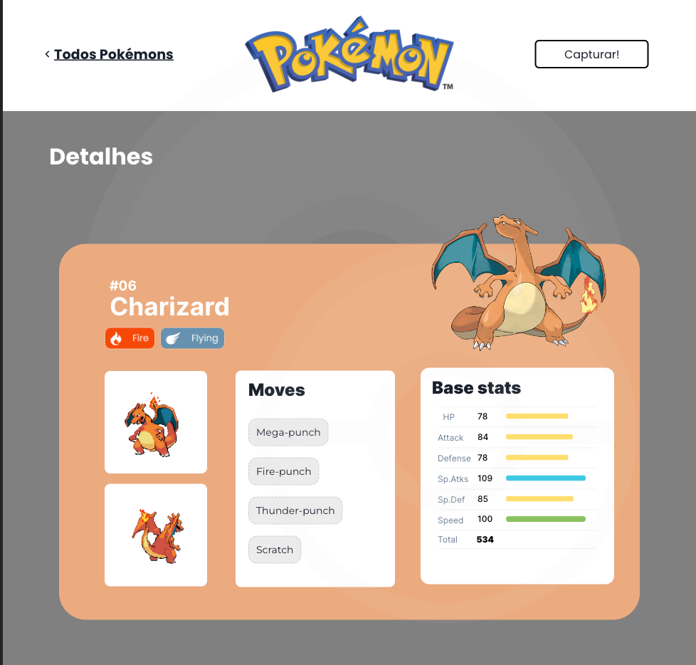

# Projeto React,APIs e ChakraUI - Pokédex


O Projeto Pokédex é um site de pokémons que possui três páginas: Home, Pokedex e Detalhes.

## Índice

- <a href="#funcionalidades">Funcionalidades do Projeto</a>
- <a href="#layout">Layout</a>
- <a href="#demonstracao">Demonstraçāo</a>
- <a href="#rodar">Como rodar este projeto?</a>
- <a href="#tecnologias">Tecnologias Utilizadas</a>
- <a href="#autoras">Pessoa Autora</a>
- <a href="#passos">Próximos passos</a>

## 📱 Funcionalidades do Projeto

- [x] Lista de Pokémons
- [x] Pokédex
- [x] Detalhes

## 💻 Layout





## 💿 Demonstraçāo

[Link demonstraçāo]()

## 📝 Como rodar este projeto?

```

```

## 📚 Tecnologias utilizadas

1. [React](https://pt-br.reactjs.org/)
2. [React Router](https://reactrouter.com/en/main)
3. [Chakra UI](https://chakra-ui.com/)
4. [Estado Global](https://pt-br.reactjs.org/docs/context.html)
5. [Axios](https://axios-http.com/docs/intro)

## 🙋‍♀️ Pessoa Autora

[Linkedin](https://www.linkedin.com/in/larissa-terada/)

## Próximos passos
